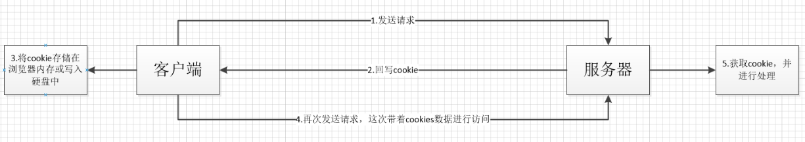

# 临毕业摸底测验（第一部分）
@(知识点)
### JavaScript （前端玩家必备技能）
1. ele.getAttribute('propName') 和 ele.propName区别
>ele.getAttribute('propName') 是返回ele标签上的propName属性，类型是字符串后者null
> ele.propName 浏览器解析元素后会生成对应的对象（如a标签生成HTMLAnchorElement）这些对象的特性会根据特定规则结合属性设置得到，对于没有对应特性的属性，只能使用getAttribute进行访问

2. mouseover和mouseenter的区别
>mouseover是鼠标经过触发的事件，mouseenter是鼠标进入触发的事件，元素绑定这两个方法，浏览器默认都给传一个事件对象，存储操作信息，不同的是mouseover会产生冒泡，它一触发，会触发它的父级，沿着捕获阶段的路径一级级向上冒泡，但是mouseenter不会产生冒泡，所以一般情况下用mouseenter比较多

3. 什么是事件代理
> 事件代理是利用事件冒泡的机制，批量的操作元素，然后根据事件源的不同，我们知道点击的是谁，去做不同的事情，比如商城的商品分类菜单，就可以这样做，给最外层的div盒子绑定点击事件，禁止它向上传播，然后它的后代元如果被点击了，根据事件源的不同（ev.target），操作不同的事情

4. localStorage和cookie的区别，cookie和session的关系！
>**localStorage和cookie的区别:**
>首先：localStorage和cookie都可以做本地存储
>localStorage是HTML5的WebStorage提供的api之一
>区别：
>1、存储空间上：cookie是4kb localStorage是5MB
>2、节省网络流量：localStorage存储在本地的数据可以直接获取，也不会像cookie一样每次请求都会传送到服务器，所以减少了客户端和服务器端的交互，节省了网络流量，还可以比较快速的显示
>3、安全性上：localStorage不会被传来传去，安全性要更高一点
4、操作上：localStorage上可以使用很多方法，比如setItem (key, value)保存数据、getItem (key)获取数据、removeItem (key)移除单个数据、clear ()清空所有数据、　key (index)获取某个索引的可以等，相对cookie的操作要更加方便一点

>**cookie和session的关系：**
它俩都是用来跟踪浏览器用户身份的会话方式
区别：
1、保持状态：cookie保存在客户端，session保存在服务器端
2、使用内容：cookie只能保存字符串类型，以文本的方式；session通过类似与Hashtable的数据结构来保存，能支持任何类型的对象(session中可含有多个对象)
3、存储大小：cookie：单个cookie保存的数据不能超过4kb；session大小没有限制
4、使用方式：
（1）cookie机制：
如果不在浏览器中设置过期时间，cookie被保存在内存中，生命周期随浏览器的关闭而结束，这种cookie简称会话cookie。
如果在浏览器中设置了cookie的过期时间，cookie被保存在硬盘中，关闭浏览器后，cookie数据仍然存在，直到过期时间结束才消失。 
Cookie是服务器发给客户端的特殊信息，cookie是以文本的方式保存在客户端，每次请求时都带上它
>（2）session机制：
>当服务器收到请求需要创建session对象时，首先会检查客户端请求中是否包含`sessionid`。
>如果有sessionid，服务器将根据该id返回对应session对象。
>如果客户端请求中没有sessionid，服务器会创建新的session对象，并把sessionid在本次响应中返回给客户端。
>通常使用cookie方式存储sessionid到客户端，在交互中浏览器按照规则将sessionid发送给服务器。如果用户禁用cookie，则要使用URL重写，可以通过response.encodeURL(url) 进行实现；API对encodeURL的结束为，当浏览器支持Cookie时，url不做任何处理；当浏览器不支持Cookie的时候，将会重写URL将SessionID拼接到访问地址后。
5、安全性：
cookie：针对cookie所存在的攻击：Cookie欺骗，Cookie截获；
session的安全性大于cookie。原因如下：
（1）sessionID存储在cookie中，若要攻破session首先要攻破cookie；
（2）sessionID是要有人登录，或者启动session_start才会有，所以攻破cookie也不一定能得到sessionID；
（3）第二次启动session_start后，前一次的sessionID就是失效了，session过期后，sessionID也随之失效。
（4）sessionID是加密的
（5）综上所述，攻击者必须在短时间内攻破加密的sessionID，这很难。
6、应用场景
cookie：
（1）判断用户是否登陆过网站，以便下次登录时能够实现自动登录（或者记住密码）。如果我们删除cookie，则每次登录必须从新填写登录的相关信息。
（2）保存上次登录的时间等信息。
（3）保存上次查看的页面
（4）浏览计数

>session：Session用于保存每个用户的专用信息，变量的值保存在服务器端，通过SessionID来区分不同的客户。
（1）网上商城中的购物车
（2）保存用户登录信息
（3）将某些数据放入session中，供同一用户的不同页面使用
（4）防止用户非法登录
 7、缺点
 `cookie`：
 （1）大小受限、用户可以操作（禁用）cookie，使功能受限、安全性较低、有些状态不可能保存在客户端
（2）每次访问都要传送cookie给服务器，浪费带宽。
（3）cookie数据有路径（path）的概念，可以限制cookie只属于某个路径下。
 `session`：
 （1）Session保存的东西越多，就越占用服务器内存，对于用户在线人数较多的网站，服务器的内存压力会比较大。
（2）依赖于cookie（sessionID保存在cookie），如果禁用cookie，则要使用URL重写，不安全
（3）创建Session变量有很大的随意性，可随时调用，不需要开发者做精确地处理，所以，过度使用session变量将会导致代码不可读而且不好维护。
 
 　　
5. 什么是闭包，你在项目中哪一块用到了闭包！
>函数执行会形成一个私有的作用域保护里面的变量不受外界的干扰，这种机制叫做“闭包”，通常情况下，闭包有两方面的用处：保护、保存
>保护：私有变量不受外界的干扰，也不干扰外界的变量，我们在团队开发的时候，通常不想自己的方法和变量干扰到别的模块，或者被别的模块干扰，通常写一个闭包
>保存：如果函数的某部分被外界占用，那它就无法被销毁了，里面的值会被保存起来，比如高级柯理化函数就是这种机制
```
let fn = function(){
   // ...
   return ()=>{
    init(){}
   }
}
```

6. js中定义函数的方式有哪些，区别是什么！
```
1、函数声明
function fn(){
 //...
}
2、函数表达式
let fn = function(){}  
3、函数构造式
new Function('n1','n2','return n1+n2');   
```
>区别：
第一种会在作用域形成后，首先进行声明和定义，它可以在任何地方调用，但是第二种只能在它定义后调用，不然就报错
第三种一般不建议这样做，因为它会导致两次解析代码，一次是解析常规ECMAScript代码，第二次是解析传入构造函数中的字符串，影响性能，而且如果涉及大量业务逻辑操作的时候，书写也不方便

7. 说出你掌握的继承方式及优缺点，并加以改进！
> 比如B想继承A的方法：
>1、原型继承：
>让B.prototype = new A() 这样就可以使用A类原型上的方法了，不好的地方是，A类实例的私有属性它也继承了，而且还把自己原型上的方法暴露了
>2、call继承
```
function A(){
   this.id = "xxx"
}
funtion B(){
  A.call(this)
}
new B()
```
不好的地方是，它是把A当成普通函数执行是，里面的this是window了，不是A类的实例，所以B类只能聚成A的私有属性和方法
>3、寄生组合继承
```
B.prototype = Object.create(A.prototype)
```
通过 Object.create方法，创建一个空对象，这个空对象的__proto__默认指向它的第一个对象A.prototype，这个B就可以只继承A类实例的公有属性和方法，不用继承A类实例的私有属性和方法了，
4、class类实现继承[ES6]
```
class A{
  constructor(){
   this.name = "111";
  }
  getX(){}
}
class B extends A{
  constructor(){
   super()  //// super相当于把A的constructor给执行了，并且让方法中this是B的实例
   this.name = "111";
  }
  getX(){}
}
```
8. 说出ES6和ES5的区别！
>ES6默认采用严格模式，不管你有没有在模块头部加上"use strict";，ES5不是
>1、通过Let、const声明的变量，不存在变量提升、不允许重新声明、如果在声明前调用会报错，而且在全局作用域下的这这样声明的变量和window没有映射机制
>2、typeof 一个未被声明的变量会报错
>3、大部分{}会形成一个块级作用域
>4、箭头函数中的this是上下文的this，没有arguments
>5、ES6 新增class 来创建一个类
>6、ES6 新增了find，foreach，includes，filter等数组遍历方法
>7、解构赋值
>8、ES6新增剩余运算符
>9、新增模板字符串用来绑定数据
>10、新增Promise用来管理异步操作
>11.....

9. 阐述JS中的同步编程和异步编程，以及你在项目中是如何来使用异步操作的！
> 虽然浏览器是多线程的，但是它只分配给JS一个线程，所以JS是单线程的（同时间只能做一件事）
> 同步：在一个线程（主栈/主任务队列），同时间只能做一件事，这件事情结束才能做下一件事，
> 异步：在主栈中执行一个任务，发现是个异步操作，不会把它执行，会把它放等待队列中，浏览器会分配其他线程去监听等待队列中的任务是否到了可执行条件，等主栈中空闲下来，监听者会把等待队列中的任务依次放入主栈中执行。
> 在项目中，常用的异步操作有：
> 定时器，事件绑定，ajax，回调函数，promise（async await）Promise本身并不是完全同步的, 当在executor中执行resolve或者reject的时候, 此时是异步操作, 会先执行then/catch等, 当主栈完成后, 才会去调用resolve/reject把存放的方法执行

10. 实现一个Promise
```
 let promise = new Promise((resolve,reject)=>{
   let xhr = new XMLHttpRequest();
   xhr.open("get","json/data.json");
   xhr.onreadystatechange = ()=>{
      if(xhr.readystate===4){
        if(/^(2|3)\d{2}$/.test(xhr.status)){
           resolve(JSON.parse(xhr.responseText))
       }
     }
   }
   xhr.send()
 });
 promise.then((res)=>{
    console.log(res)
 }).catch((err)=>{
     console.log(err);
 })
```

### HTTP && AJAX && 跨域 （18+玩家必备技能，初级玩家需要了解一些的）
1. 写出项目中经常用到的性能优化方案
>项目中性能优化方案一般分为三类：
>1、减少http请求大小和次数
>压缩代码、合并文件、数据传输采用Json格式、雪碧图、图片懒加载、首屏分页加载
>2、代码优化
>不要死循环和死递归、少用import（因为它是同步的）、少用标签直接写样式（css从右到左解析）、使用缓存、使用模板字符串或者文档碎片进行数据绑定、能用CSS解决的就不要用js、减少ifame的使用
>3、CDN和网络通信优化
>使用CDN管理静态资源
>使用gzip加速

2. 从浏览器地址栏输入URL到显示页面，中间都经历了什么（尽可能写详细，最好回答出TCP的三次握手和四次挥手，以及浏览器加载页面的细节）
>1、浏览器中输入url地址
>2、浏览器查看缓存，如果请求资源在缓存并且新鲜，跳到转码步骤
>3、dns拿到url进行反解析，找到外网ip(三次握手）
>4、根据外网ip找到对应的服务器，通过服务器上站点管理工具找到端口号管理的服务通过路径和问号传参找到对应的文件（如果请求的是HTML或者CSS等这样的资源文件，服务器返回的是资源文件中的源代码），传给客户端
>5、客户端浏览器接受到服务器返回的源代码，基于自己内部的渲染引擎（内核）开始进行页面的绘制和渲染
>6、首先计算DOM结构，生成DOM TREE
>7、自上而下执行源代码，遇到css外链、js、图片都会重新执行上面的步骤，直到拿到所有的资源（四次挥手）
>8、根据获取的CSS生成带样式的RENDER TREE
>9、开始渲染和绘制

>浏览器和服务器建立连接的时候三次握手：
1.浏览器向服务器发送一个建立连接的请求；
2.服务器收到请求，同意建立连接并且反馈给浏览器响应；
3.浏览器发送给服务器确认收到响应的请求

>服务器和浏览器断开链接是一般有四次对话：
1.浏览器发送给服务器想断连接的请求；
2.服务器收到浏览器的请求；
3.发送给浏览器同意断开请求的响应；
4.浏览器断开链接，并且发送给服务器已经断开连接的请求；


3. 说出你所熟知的HTTP状态码！GET和POST有啥区别！
> HTTP状态码：
> 200 成功
> 301永久性转移
> 302临时性转移
> 304缓存
> 400  参数错误
> 401 无权限访问
> 404 找不到
413：和服务器交互的内容资源超过服务器最大限制，服务器不执行
> 500 服务器端出现错误
> 503 服务器端超负荷
> 
GET和POST的区别：
get是通过问号参数的方式放服务器端传递数据，而post是通过请求主体
get请求会产生缓存，post不会
post请求相对get请求要更安全一点
get请求url相对要长一点，因为浏览器会被长度有限制，有可能会造成信息的丢失

4. 什么是HTTP报文，你熟知的报文都有哪些！
> 一次完整的请求+响应称为“**Http报文**”
熟知的报文：通用头、请求头、响应头、请求信息
5. 能说下304具体怎样实现吗？
> 后台响应头里面设置cache-control: max-age=3600，第一次加载资源的时候返回的是2或者3开头的状态码，并且会在浏览器中记录max-age，第二个打开的时候，
> 如果只是浏览器打开，会先判断有没有这个资源，如果有再判断max-age到时间了吗？如果没到，就直接去缓存，如果已经过期了，就会向服务器请求，如果服务器收到请求发现资源没改变就会返回304，告诉浏览器你去读缓存吧
> 如果是用浏览器刷新的，那么浏览器不会去判断max-age了，直接去服务器拿，如果服务器判断资源没变过，则还是会返回304，和上面是一样的，所以刷新一下，其实很可怕，等于把所有的资源都要去服务器请求一边，问问服务器我过期了没有。

6. 跨域是什么？http协议中如何判断跨域？如何解决跨域问题？
>因为协议域名端口号的不同，导致一个资源无法去另一个资源，这个问题就叫做“跨域”
解决跨域的方式：
如何解决跨域问题？
- jsonp 
- cors
- postMessage
- window.name
- location.hash
- http-proxy
- nginx
- websocket
- document.domain

7. HTTP2具体内容？SDPY了解么？

8. HTTPS如何实现？tsl/ssl是什么？对称加密、非对称加密在什么时候、对什么数据加密？
9. DNS劫持是什么？
>DNS劫持又称域名劫持,是指通过某些手段取得某域名的解析控制权，修改此域名的解析结果，导致对该域名的访问由原IP地址转入到修改后的指定IP，其结果就是对特定的网址不能访问或访问的是假网址，以达到骗取用户相关资料或入侵他人电脑的目的。
10. 封装一个AJAX库！

